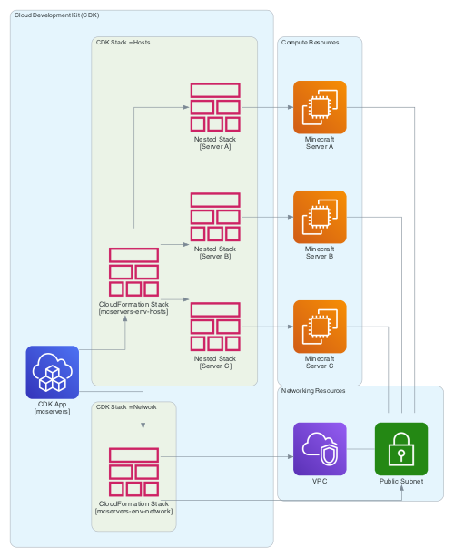

# Minecraft Server Farm 

Resources for running Minecraft game servers on AWS EC2 virtual machines.

## Overview

This project uses the [AWS Cloud Development Kit (CDK)](https://aws.amazon.com/cdk/) to define and provision infrastructure that can be used to run Minecraft game servers. The following diagram demonstrates how the CDK concepts are mapped to the AWS resources that run the Minecraft game servers:

Take a look at the [Getting Started](./docs/getting-started.md) guide if you are interested in running your own Minecraft Server Farm using this project.

## More information

The following resources are also available:

- [Codebase Overview](./docs/codebase-overview.md) for implementation details.
- [Contribution Guide](./CONTRIBUTING.md) for information about contributing to this project.
- [GitHub Issues](https://github.com/cpolanec/minecraft-server-farm/issues) for searching known issues or reporting new issues
- [GitHub Discussions](https://github.com/cpolanec/minecraft-server-farm/discussions) for discussing existing functionality or proposing new functionality
